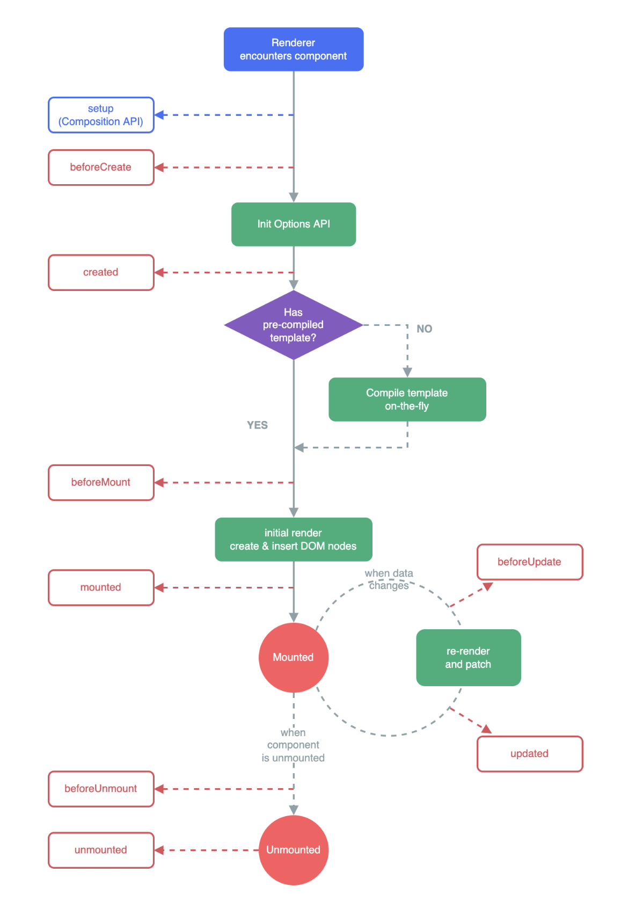

# Vue Lifecycle - Option API

Ketika aplikasi vue pertama dijalankan (created), maka aplikasi tersebut akan melewati beberapa langkah - langkah inisialisasi atau disebut dengan lifecycle hooks.

## Lifecycle hooks

Merupakan sebuah "jendela" untuk melihat bagaimana sebuah library/framework bekerja. Dengan lifecycle hooks kita dapat lebih mengontrol jalannya aplikasi

Terdapat 4 main events dalam sebuah vue lifecycle:

- **creation** => ketika pertama kali aplikasi terbuat
- **mounting** => ketika DOM pertama kali diinisialisasi
- **updates** => ketika data terupdate dan dom diupdate
- **destruction** => ketika aplikasi akan didestroy

## Demo

### Creation Hooks

- `beforeCreate`

  di dalam lifecycle ini, inisialisasi option api belum ada, sehingga data/state belum bisa diakses/dimanipulasi

- `created`

  di dalam lifecycle ini, inisialisasi option api sudah ada, sehingga data/state sudah bisa dimanipulasi, namun DOM belum ada sehingga belum bisa memanipulasi DOM (cocok untuk fetching data)

### Mounting Hooks

- `beforeMount`

  di dalam lifecycle ini, data/state sudah ada, namun DOM belum ada. Sama seperti lifecycle `created` namun dijalankan setelahnya

- `mounted`

  disini data/state sudah ada, dan DOM sudah ada, sehingga bisa dimanipulasi

### Updates Hooks

- `beforeUpdate`

  lifecycle ini akan dijalankan ketika state berubah dan DOM _akan_ diupdate

- `updated`

  lifecycle ini akan dijalankan ketika state berubah dan DOM _sudah_ diupdate

## References

[Lifecycle Hooks Docs](https://vuejs.org/guide/essentials/lifecycle.html)

[Understanding Vue Lifecycle](https://www.digitalocean.com/community/tutorials/vuejs-component-lifecycle)
