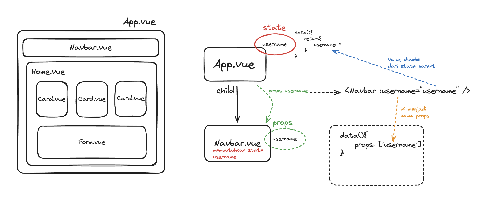

# Vue Components - Option API

Components memungkinkan kita untuk membagi/split UI menjadi beberapa bagian independen (dan memungkinkan untuk direusable)

## Component in a nutshell


## Defining a component

Secara umum, suatu component dalam Vue memiliki 3 unsur:

- script

  berisi script vue

  ```js
  <script>
  export default {
    data() {
      return {
        count: 0
      }
    }
  }
  </script>
  ```

- template

  berisi template html

  ```js
  <template>
    <button id="button" @click="count++">You clicked me {{ count }} times.</button>
  </template>
  ```

- style

  berisi css/styling

  ```css
  <style>
    button {
      padding: 10px;
    }
  </style>
  ```

## Using a component

Untuk menggunakan component sebagai `child` di `parent` component, kita harus melakukan step-step sebagai berikut.

1.  import component child di parent

    ```js
    import ButtonCounter from "./ButtonCounter.vue";
    ```

2.  Register/daftarkan child component di `components` di script

    ```js
    export default {
      data() {
        return {};
      },
      components: {
        ButtonCounter, // daftarkan disini
      },
    };
    ```

3.  Pakai child component di template

    ```js
    <template>
      <ButtonCounter />
    </template>
    ```

## Props & Emit

Untuk berkomunikasi antar component di vue, kita dapat menggunakan emits & props

### Props

Merupakan cara sebuah _parent component_ mengirim state/data ke _child component_

> state yang dikirim bersifat **read-only**



### Emits

Merupakan cara sebuah _child component_ mengirimkan/memberi tahu sebuah **event** ke _parent component_


## References

- [components basic](https://vuejs.org/guide/essentials/component-basics.html#defining-a-component)

- [component registration](https://vuejs.org/guide/components/registration.html)

- [props](https://vuejs.org/guide/components/props.html)

- [emits](https://vuejs.org/guide/components/events.html)
